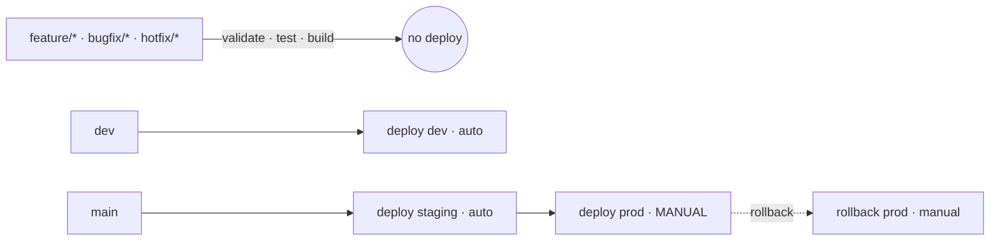

# CI/CD Pipeline Template

[](https://github.com/matthumann/cicd-pipeline-template/actions/workflows/ci.yml)
[](LICENSE)

A reference **branch-aware CI/CD pipeline** with a clean branching model,
environment promotion, a manual production-approval gate, and a defined rollback
path. Built primarily for **GitLab CI** (`.gitlab-ci.yml`) with a parallel
**GitHub Actions** workflow so it runs natively here.

It's a *template*: a deliberately small sample app sits underneath so the
pipeline lints, tests, and packages real code — drop in your own service and the
workflow is ready to go.

---

## Why it exists

Most "CI examples" run tests on one branch and stop. Real delivery needs a
**branching model the pipeline understands** and **governance you can audit** —
who shipped what, when, and who approved it. This template shows that end to end:
controlled promotion from development to production with the release controls a
regulated (e.g. SOX) environment expects.

## Branching model

`main` is always production; `dev` is the integration trunk; all work happens on
short-lived typed branches. The pipeline does something different for each.

| Branch | From | Into | Pipeline does |
|---|---|---|---|
| `main` | — | — | staging (auto) → **prod (manual approval)** |
| `dev` | `main` | `main` via `release/*` | auto-deploy to **dev** |
| `feature/*` | `dev` | `dev` | validate · test · build |
| `bugfix/*` | `dev` | `dev` | validate · test · build |
| `hotfix/*` | `main` | `main` + back-merge `dev` | validate · test · build |
| `release/*` | `dev` | `main` | full build (stabilization) |



Branch names are **enforced** by the pipeline, not just documented.
Full detail → [docs/branching-strategy.md](docs/branching-strategy.md).

## Pipeline stages

`validate` (lint + branch-name check) → `test` (pytest + coverage) → `build`
(SHA-stamped artifact) → `deploy` (branch-specific promotion) → `rollback`
(manual, on `main`).

Walkthrough and the audit/governance controls →
[docs/pipeline.md](docs/pipeline.md).

## Layout

```
.gitlab-ci.yml                 primary pipeline (GitLab CI)
.github/workflows/ci.yml       GitHub Actions mirror (runs here)
.gitlab/merge_request_templates/Default.md
docs/branching-strategy.md     the branching model
docs/pipeline.md               stage-by-stage + governance controls
scripts/{deploy,rollback,validate}.sh   deploy hooks (safe no-op placeholders)
src/ , tests/                  sample app so the pipeline has real code
CONTRIBUTING.md                how the branch/MR workflow is used
```

## Use it

1. Copy `.gitlab-ci.yml` (or `.github/workflows/ci.yml`) into your repo.
2. Create `dev` from `main`; protect both (no direct pushes; reviews required).
3. Replace `scripts/deploy.sh` / `rollback.sh` / `validate.sh` with real commands.
4. Swap the sample app in `src/` for your service.
5. For the prod gate on GitHub, add required reviewers to the `prod`
   [environment](https://docs.github.com/actions/deployment/targeting-different-environments);
   on GitLab it's the built-in `when: manual` step.

Run the checks locally:

```bash
pip install -r requirements.txt ruff pytest pytest-cov
ruff check src tests
pytest --cov=src
```

## License

MIT — see [LICENSE](LICENSE).
