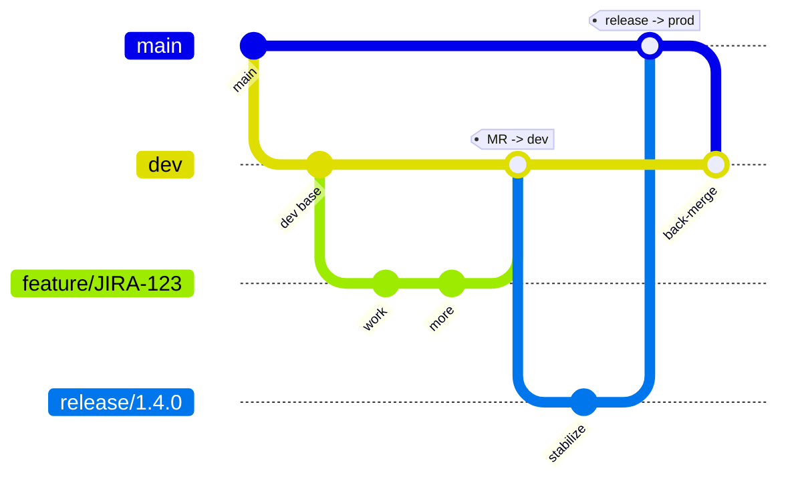

# Branching strategy

A two-tier trunk model: `main` is always production, `dev` is the integration
trunk, and all day-to-day work happens on short-lived typed branches cut from
`dev` (or, for emergencies, from `main`). It keeps a clean production line while
giving the team a shared place to integrate before release.

## The branches

| Branch | Cut from | Merges into | Lifetime | Pipeline behavior |
|---|---|---|---|---|
| `main` | — | — | permanent, protected | deploys to **staging** automatically, **prod** on manual approval |
| `dev` | `main` | `main` (via `release/*`) | permanent, protected | auto-deploys to **dev** |
| `feature/*` | `dev` | `dev` | short-lived | validate + test + build (no deploy) |
| `bugfix/*` | `dev` | `dev` | short-lived | validate + test + build (no deploy) |
| `hotfix/*` | `main` | `main` **and** `dev` | short-lived | validate + test + build (no deploy) |
| `release/*` | `dev` | `main` | short-lived | full build; stabilization only |

## Naming convention

```
feature/<ticket>-short-description     feature/JIRA-123-add-export
bugfix/<ticket>-short-description      bugfix/JIRA-145-null-on-empty-cart
hotfix/<ticket>-short-description      hotfix/INC-9921-prod-login-500
release/<version>                      release/1.4.0
```

The pipeline's `branch-naming` job rejects anything that doesn't match, so the
convention is enforced, not just documented.

## Flow



### Normal change (feature / bugfix)
1. Branch from `dev`: `git switch -c feature/JIRA-123-add-export dev`
2. Open a Merge/Pull Request **into `dev`**. The pipeline runs validate → test → build.
3. On approval + merge, `dev` auto-deploys to the dev environment.

### Release to production
1. Cut `release/1.4.0` from `dev` to freeze scope; only fixes land here.
2. MR `release/1.4.0` **into `main`**.
3. Merging `main` auto-deploys to **staging**; **prod** waits on the manual
   approval gate (the SOX-style release control).

### Hotfix (urgent production fix)
1. Branch from `main`: `git switch -c hotfix/INC-9921-prod-login-500 main`
2. MR **into `main`** → staging → manual prod approval.
3. **Back-merge** the hotfix into `dev` so the fix isn't lost on the next release.

## Protected-branch rules (configure in the host)
- `main` and `dev`: no direct pushes; changes only via reviewed MR/PR.
- `main`: require a passing pipeline **and** the manual prod approval before deploy.
- Require at least one reviewer (two for `main`) — see governance in
  [pipeline.md](pipeline.md).
