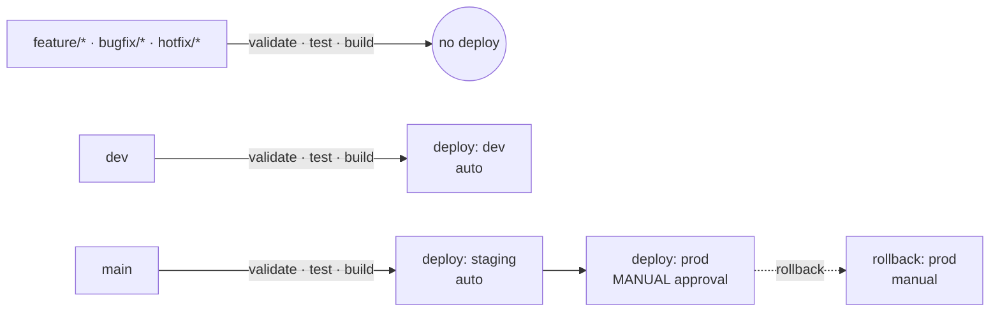

# Pipeline reference

Stage-by-stage walkthrough of [`.gitlab-ci.yml`](../.gitlab-ci.yml) (and its
GitHub Actions mirror [`.github/workflows/ci.yml`](../.github/workflows/ci.yml)).
The pipeline is **branch-aware**: the same definition behaves differently
depending on which branch triggered it.

## Stages

| Stage | Jobs | Runs on | Purpose |
|---|---|---|---|
| `validate` | `lint`, `branch-naming` | every branch + MR | fast fail: style + branch-name convention |
| `test` | `unit-test` | every branch + MR | pytest with coverage, JUnit + Cobertura reports |
| `build` | `build` | every branch + MR | package a SHA-stamped artifact, kept 1 week |
| `deploy` | `deploy:dev`, `deploy:staging`, `deploy:prod` | branch-specific | environment promotion |
| `rollback` | `rollback:prod` | `main`, manual | re-point prod at the previous release |

## What runs where

- **Feature/bugfix/hotfix branches** never deploy — they only prove the change is
  safe (lint, tests, buildable artifact) before review.
- **`dev`** continuously deploys to the dev environment on every merge.
- **`main`** deploys to staging automatically, then **blocks** on a manual
  approval before prod (`when: manual`, `allow_failure: false`). The pipeline
  shows as *blocked*, not *passed*, until a human approves.
- **`deploy:prod` `needs: deploy:staging`** — prod can never run without staging
  having succeeded first.

## Promotion & rollback model

- One artifact is built **once** per commit (`app-<sha>.tar.gz`) and the *same*
  artifact is promoted dev → staging → prod. Nothing is rebuilt between
  environments, so what you tested is what ships.
- `deploy.sh` is written to be idempotent and to record a release marker;
  `rollback.sh` re-points the environment at the previous marker. Rollback is a
  first-class manual job on `main`.

## Governance / audit controls (the "SOX-grade" part)

These are the controls that make the pipeline audit-ready — the difference
between "we have CI" and "we can prove who shipped what, when, and who approved
it":

1. **No direct pushes to `main`/`dev`** — every production change has a reviewed
   MR/PR with an approver recorded.
2. **Manual prod gate** — deployment to production requires an explicit human
   approval that the platform timestamps and attributes (segregation of duties).
3. **Enforced branch naming + MR template** — every change is traceable to a
   ticket ([merge request template](../.gitlab/merge_request_templates/Default.md)).
4. **Immutable, SHA-stamped artifacts + retained reports** — JUnit/coverage
   artifacts and the build SHA give an evidence trail for each release.
5. **Documented rollback** — a defined, tested recovery path, not an ad-hoc fix.

## Adapting this template
- Replace the bodies of `scripts/deploy.sh`, `rollback.sh`, `validate.sh` with
  real commands for your platform.
- Swap the Python sample app for your service; update `requirements.txt` and the
  lint/test commands if you change languages.
- Add environments (e.g. `qa`, `uat`) by copying a `deploy:*` job and its rule.
